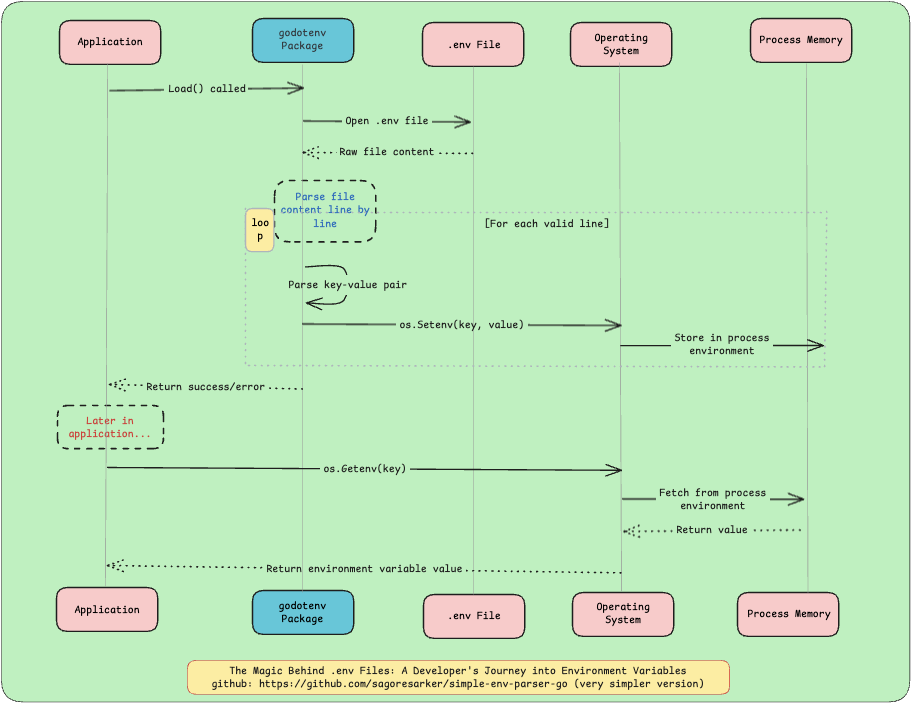

# SimpleEnv Parser (A very basic env loader implementation)

A lightweight environment variable parser written in Go. This project provides a simple way to load and parse .env files, similar to but simpler than the popular godotenv package. It is designed as a very basic implementation for educational purposes, demonstrating how an environment loader works under the hood.

N.B: This is a very basic implementation for educational purposes, it doesn't support multiple .env files, variable interpolation, escape sequences, export prefix, etc.

And I use declarative function name to make it more readable as it is for learning purpose.

## Features

- Parse `.env` files with basic key-value pairs
- Skip comments and empty lines
- Trim whitespace and quotes from values
- Set parsed variables directly into the current OS process
- Provide utility function to retrieve environment variables with default values
- Simple error handling and logging

### Example .env File

```env
APP_NAME=SimpleEnvParser
APP_ENV=development
PORT=8080
# This is a comment
EMPTY_VALUE=
```

## File Format

- Each line should be in `KEY=VALUE` format
- Lines starting with `#` are treated as comments
- Empty lines are ignored
- Values can be quoted (quotes will be removed)
- Leading and trailing whitespace is removed from both keys and values

## Project Structure

```
simple-env-parser-go/
├── envparser/
│   ├── envparser.go    # Core parsing logic
│   └── load.go        # Load and set parsed variables
├── utils/
│   └── utils.go       # Utility functions
├── main.go            # Example usage
├── .env               # Example environment file
├── go.mod
└── README.md
```

## Functions Reference

Let's see the functions reference of this project for better understanding. There are three important functions in this project.

#### 1. `LoadTheEnvFileAndSetEnvVariablesOnCurrentOSProcess(filename string) error`
Reads the .env file, parses it, and sets environment variables on the current OS process.

#### 2. `ReadFromEnvFileAndParse(filename string) ([]EnvVar, error)`
Reads a file and returns a slice of environment variables.

#### 3. `GetEnvVariableFromCurrentOSProcess(key, defaultValue string) string`
Retrieves an environment variable from the current OS process with a fallback default value.

## Limitations

This is a simple implementation for educational purposes and doesn't support:
- Multiline values
- Variable interpolation
- Escape sequences
- Export prefix
- Multiple .env files

# Sequence Diagram of a ideal env loader like [`godotenv`](https://github.com/joho/godotenv)

Before end, let's see a sequence diagram of a ideal env loader like [`godotenv`](https://github.com/joho/godotenv) as its a good starting point to understand how an env loader works.



*Note: This is a sequence diagram of a ideal env loader, in real world scenario it may vary.*